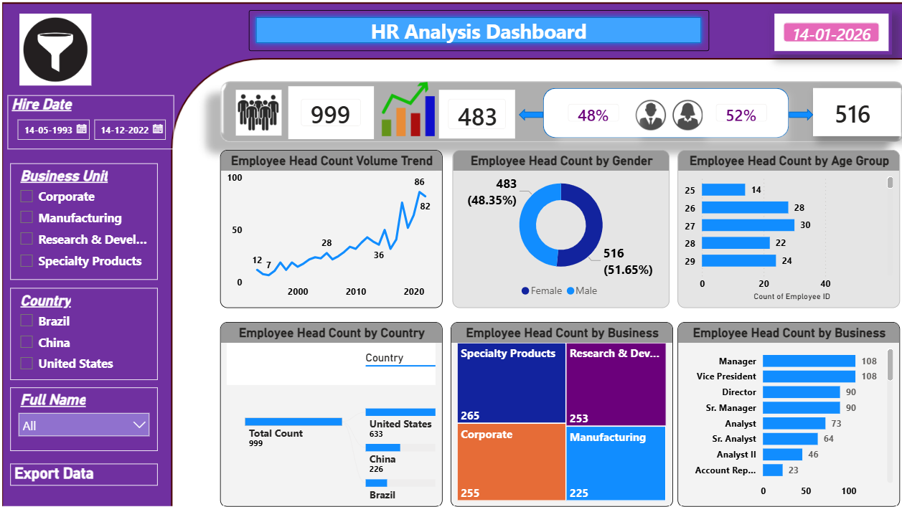

## 📊 HR Analysis Power BI Dashboard

🚀 An interactive HR Analytics Dashboard built using Power BI to analyze workforce trends, employee demographics, organizational structure, and business unit distribution.

## 🎯 Project Objective

To design and develop an executive-level HR analytics dashboard that transforms raw employee data into actionable insights for strategic decision-making in:

Workforce Planning

Diversity & Inclusion Monitoring

Organizational Structure Evaluation

Hiring Trend Analysis

## 📌 Key Performance Indicators (KPIs)

🔢 Total Employees: 999

👩 Female Employees: 483 (48%)

👨 Male Employees: 516 (52%)

📅 Data Snapshot: 14-01-2026

📈 Dashboard Insights & Analysis
📊 Employee Headcount Trend

Time-series visualization of workforce growth

Identifies hiring acceleration periods

Tracks long-term expansion trends

## 👥 Gender Distribution

Female: 48%

Male: 52%

Supports diversity analysis

## 🎂 Age Group Distribution

Workforce segmentation by age

Useful for succession and retirement planning

## 🌍 Country-Wise Distribution

United States: 633

China: 226

Brazil: Remaining distribution

Identifies geographic workforce concentration

## 🏢 Business Unit Distribution

Treemap representation of:

Specialty Products (265)

Corporate (255)

Research & Development (253)

Manufacturing (225)

## 🧑‍💼 Organizational Role Structure

Breakdown by hierarchy:

Manager

Vice President

Director

Senior Manager

Analyst

Senior Analyst

Account Representative

## 🎛️ Interactive Features

✔ Hire Date slicer
✔ Business Unit filter
✔ Country filter
✔ Employee Name dropdown

All visuals dynamically update based on filter selections.

## 📸 Dashboard Preview



> 🔎 Static preview of the dashboard. Download the PBIX file from the `powerbi_reports/` folder for full interactivity.

⚠️ Screenshot is a static preview. Download the PBIX file for full interactivity.

## 🛠️ Technical Skills Demonstrated

Power BI Desktop

Data Modeling & Relationships

DAX Measures & Calculations

KPI Card Design

Treemap, Donut, Bar & Line Charts

Interactive Slicers

Business Intelligence Reporting

## 📂 Repository Structure
```
HR-Analysis-PowerBI-Dashboard/
│
├── datasets/
├── powerbi_reports/
├── results/
└── README.md
```

👨‍💻 Author

## ManiKantan P
Business Analyst | Power BI | SQL | Python
